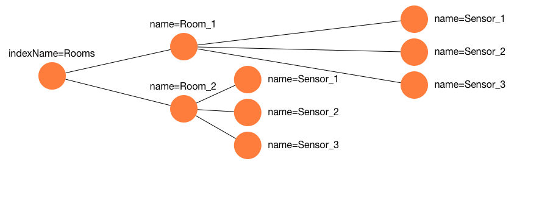

# MWG Task API

> Why a (task/traversal/promise) API ?

Manipulating the Many World Graph through an asynchronous API allows to write blazing-fast code without compromising on high-level abstractions. Asynchronous code often leads to what is known as [CallBack Hell](http://callbackhell.com/), that damage both the readability of code and its reusability, due to nested callbacks. To overcome this, modern libraries and APIs provide Promises and/or Futures. The common goal of these approaches is to offer a way to chain reusable elements and to synchronize the program flow in order to avoid repeated and error prone code. MWG comes with a powerful API to manipulate and traverse graphs, which hides low-level, asynchronous task primitives behind an expressive API. Graph processing can be ressource-hungry. To make the most out of the available main memory, MWG provides an API to explicitly free the memory of a node. A `.free()` method can be called once a node will not be used anymore.

# Running example

Let's consider the following simple graph as a running example:

> A graph composed by 2 rooms, themself composed by 3 sensors associated through the relation: __sensors__ . All rooms should be indexed by their name, through the global index: __rooms__.

This graph can be build by the following task, build using the fluent Java DSL.

``` java
loop("1","2",
	newNode()
	.setProperty("name", Type.STRING, "room_{{i}}")
	.indexNode("rooms", "name")
	.asVar("parentRoom")
	.loop("1","3",
		newNode()
		.setProperty("sensor", Type.STRING, "sensor_{{i}}")
		.addTo("sensors", "parentRoom")
	)
).execute(g, null);
```

Without black magic, action are just chained by `.` as any fluent DSL an inital action can be transparently build using a global static import.

```java
import static org.mwg.task.Actions.*;
```

The result graph can be represented as follow:




# TaskContext and subTasks

In a nutshell, tasks are a chain of reusable actions that manipulate result and variables stored in a context. Such task context is accesible in some specific action where developers has the freedom to access and read current result and variables.


# Variables scope

coming soon...

## Core Tasks

The MWG task api is extensible by plugins. For instance, the importer plugin defines dedicated tasks for the manipulation of various format such as CSV.
However, hereafter is detailled the set of tasks proposed by default in MWG core module.

- [loop](tasks/loop.md)
- [loopPar](tasks/loopPar.md)
- [get](tasks/get.md)
- [traverse](tasks/traverse.md)
- todo....

## Task execution methods

A task is a prototype of execution that can be define statically and independently to any graph instances.
A task is executed ON a graph.
The simplest API to do so is the following: 

``` java
task.execute(graph, null);
```

If the task aims at returning a result, then the last task context result will be return in a result callback passed as parameter.
This callback should be of the type of Callback<TaskResult>.

Such as:

``` java
task.execute(graph, (result)-> { 
	//DO something 
	if(result != null){
		//you are responsible to free the result set!
		result.free();
	}
});
```

> WARNING: if the callback is not null, you are responsible to free the result, cache full error will occurs otherwise.


## Task hook

The task execution engine offers various hook to intercept the execution flow for debug or print purposes. Task hooks can be injected either locally (for a particular task) or globally for the graph (for debug purposes).

A sample plugin is present in the Core as an example of a global task Hook.
Therefore it is possible to execute all task in verbose mode using the following Graph Builder configuration.

``` java
Graph g = new GraphBuilder()
	.withMemorySize(10000)
 	.withPlugin(new org.mwg.utility.VerbosePlugin())
	.build();
```


# Composition patterns

- Sub Action
- Sub Task
- Composite Task...

# Parralel tasks patterns

- **coming soon...**
- work only with the HybridScheduler....
